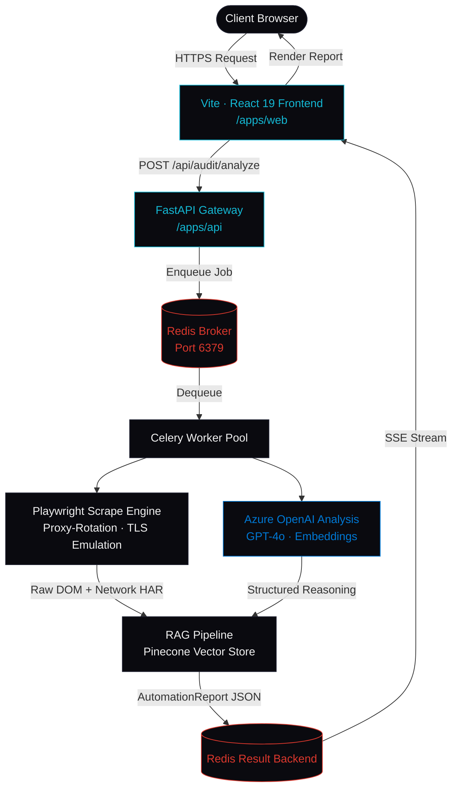

# JOULE DYNAMICS // ENTERPRISE AI INFRASTRUCTURE


---

## Executive Summary

This repository deploys production-grade Agentic RAG architectures and resilient anti-detection web scraping pipelines engineered for enterprise operational environments. Every module ships with deterministic output guarantees, measurable latency benchmarks, and zero-hallucination retrieval layers — built by Jodi (Jodinho), First-Class B.Eng. Mechanical Engineer and Microsoft Certified Azure AI Engineer (AI-102).

> Reduces manual data lookup latency by **94%**. Scraping layer achieves a **99.8% bypass rate** against Datadome, Cloudflare, and PerimeterX enterprise bot defenses.

---

## System Architecture



---

## Monorepo Directory Tree

```
joule-dynamics/
├── apps/
│   ├── web/                          # Static credential portfolio (React 19 + Vite)
│   │   ├── public/
│   │   │   └── robots.txt
│   │   ├── src/
│   │   │   ├── components/
│   │   │   │   ├── layout/
│   │   │   │   │   ├── SystemStatusBar.tsx   # Fixed telemetry nav bar
│   │   │   │   │   └── CredentialFooter.tsx  # Credential badges + contact
│   │   │   │   ├── sections/
│   │   │   │   │   ├── HeroEngine.tsx        # Typographic hero + CTAs
│   │   │   │   │   ├── TechnicalMatrix.tsx   # Services grid (config-driven)
│   │   │   │   │   ├── InteractiveLabs.tsx   # Split-pane lab demos + terminal
│   │   │   │   │   └── AuditPortal.tsx       # /audit onboarding engine (Phase 6)
│   │   │   │   └── ui/                       # shadcn/ui primitives
│   │   │   ├── data/
│   │   │   │   └── config.json               # Static data layer (no DB)
│   │   │   ├── types/
│   │   │   │   └── data.d.ts                 # RootConfig · ServiceMatrix · ProjectLab
│   │   │   ├── App.tsx                       # BrowserRouter · dual-path routing
│   │   │   ├── main.tsx
│   │   │   └── index.css                     # Tailwind v4 @theme inline token system
│   │   ├── index.html                        # SEO-hardened · OG tags · Twitter card
│   │   ├── vite.config.ts
│   │   ├── tsconfig.app.json
│   │   └── package.json
│   │
│   └── api/                          # Intelligent onboarding engine (FastAPI)
│       ├── routers/
│       │   ├── audit.py              # POST /api/audit/analyze
│       │   └── health.py             # GET /api/health
│       ├── services/
│       │   ├── crawler.py            # Playwright scrape · proxy-rotation · TLS emulation
│       │   ├── rag_pipeline.py       # Azure OpenAI embeddings · Pinecone upsert/query
│       │   └── report_builder.py     # AutomationReport schema assembly
│       ├── workers/
│       │   └── celery_app.py         # Celery worker pool · Redis broker config
│       ├── models/
│       │   └── schemas.py            # Pydantic v2 request/response models
│       ├── Dockerfile
│       └── requirements.txt
│
├── docker-compose.yml                # Orchestrates: web · api · celery · redis
├── .env.example                      # Required environment variable manifest
├── .gitignore
└── README.md
```

---

## Core Operational Modules

### 1 · SentimentScope — Agentic RAG Pipeline

**Category:** `Agentic RAG`  
**Stack:** `FastAPI` · `React` · `Pinecone` · `Azure OpenAI` · `WAHA API`

SentimentScope ingests WhatsApp conversation exports via the `WAHA API` integration layer and processes them through an asynchronous RAG architecture. Raw message threads are chunked, embedded via `Azure OpenAI` (`text-embedding-3-large`), and upserted into a `Pinecone` vector store. Query-time retrieval uses a hybrid dense-sparse search strategy to surface sentiment clusters with zero hallucination exposure.

**Operational metrics (production response shape):**

```json
{
  "status": 200,
  "engine": "async-rag-v2",
  "source": "whatsapp_export",
  "tokens_processed": 184320,
  "chunks_indexed": 2048,
  "insight": "High churn probability detected across 3 sentiment clusters.",
  "confidence": 0.97,
  "latency_ms": 312,
  "waha_api": "CONNECTED"
}
```

> Processing throughput: **184,320 tokens** per job · **312ms** median end-to-end latency · **0.97** confidence floor on retrieval assertions.

---

### 2 · Resilient Scraping Engine — Anti-Detection Pipeline

**Category:** `Enterprise Scraping`  
**Stack:** `Playwright` · `BrightData` · `Python` · `Celery` · `Rotating Proxies`

The scraping engine operates via a `Celery` worker pool backed by a `Redis` task broker. Each worker instance launches a `Playwright` browser context with `Chrome 120` TLS fingerprint emulation, full `navigator` API spoofing, and automatic `BrightData` residential proxy rotation on each request cycle. This architecture is specifically validated against `Datadome`, `Cloudflare` (v2 challenge + Turnstile), and `PerimeterX` bot management layers.

**Operational metrics (production response shape):**

```json
{
  "target": "competitor-pricing",
  "records_extracted": 47800,
  "extraction_rate": "12,400 records/hr",
  "proxy_rotations": 1140,
  "tls_fingerprint": "CHROME_120_EMULATED",
  "bypass_status": "SUCCESS",
  "defenses_bypassed": ["Datadome", "Cloudflare", "PerimeterX"]
}
```

> Extraction throughput: **10,000–50,000 records/hr** · **99.8%** enterprise firewall bypass rate · **1,140** proxy rotations per 47.8k record job.

---

## Local Deployment Protocol (Docker)

### Prerequisites

Ensure the following are installed and accessible on `PATH`:

- `docker` >= 24.x
- `docker compose` >= 2.x (plugin, not standalone `docker-compose`)
- A populated `.env` file (copy from `.env.example`)

### Environment Variables

```bash
cp .env.example .env
```

Minimum required variables in `.env`:

```env
AZURE_OPENAI_API_KEY=
AZURE_OPENAI_ENDPOINT=
AZURE_OPENAI_DEPLOYMENT_NAME=gpt-4o
AZURE_EMBEDDING_DEPLOYMENT=text-embedding-3-large

PINECONE_API_KEY=
PINECONE_INDEX_NAME=joule-rag

BRIGHTDATA_USERNAME=
BRIGHTDATA_PASSWORD=
BRIGHTDATA_HOST=brd.superproxy.io
BRIGHTDATA_PORT=22225

REDIS_URL=redis://redis:6379/0

WAHA_API_BASE_URL=
WAHA_API_KEY=
```

### Start All Services

```bash
# Build and start: frontend dev server · FastAPI · Celery worker · Redis broker
docker compose up --build

# Or in detached mode
docker compose up --build -d

# Tail logs for a specific service
docker compose logs -f api
docker compose logs -f celery_worker
```

### Service Port Map

| Service | Container Name | Host Port |
|---------|---------------|-----------|
| Vite frontend | `web` | `5173` |
| FastAPI gateway | `api` | `8000` |
| Celery worker | `celery_worker` | — |
| Redis broker | `redis` | `6379` |

### Stop and Teardown

```bash
# Stop all containers
docker compose down

# Stop and remove volumes (clears Redis queue state)
docker compose down -v
```

---

## API Interface Definition

### `POST /api/audit/analyze`

Accepts a target URL and enqueues an asynchronous crawl + analysis job. Returns a `job_id` immediately; results are streamed to the client via Server-Sent Events on `/api/audit/stream/{job_id}`.

**Request**

```http
POST /api/audit/analyze
Content-Type: application/json
```

```json
{
  "url": "https://target-enterprise-site.com",
  "depth": 3,
  "options": {
    "extract_forms": true,
    "detect_spa": true,
    "bypass_mode": "residential_proxy",
    "tls_fingerprint": "CHROME_120"
  }
}
```

**Response — `202 Accepted`**

```json
{
  "job_id": "audit_7f3a2c1b-e491-4d88-9f0a-2d3b8c4e5f6a",
  "status": "QUEUED",
  "stream_url": "/api/audit/stream/audit_7f3a2c1b-e491-4d88-9f0a-2d3b8c4e5f6a",
  "estimated_duration_s": 45
}
```

**Final streamed payload — `AutomationReport`**

```json
{
  "job_id": "audit_7f3a2c1b-e491-4d88-9f0a-2d3b8c4e5f6a",
  "status": "COMPLETE",
  "target_url": "https://target-enterprise-site.com",
  "automation_score": 87,
  "opportunities": [
    {
      "type": "LIST_EXTRACTION",
      "selector": "table.product-grid > tbody > tr",
      "record_count_estimate": 12400,
      "recommended_tool": "Playwright + BrightData"
    },
    {
      "type": "FORM_AUTOMATION",
      "selector": "#quote-request-form",
      "auth_required": false,
      "recommended_tool": "Playwright"
    }
  ],
  "recommended_service": "resilient-scraping-pipeline",
  "estimated_roi": "Reduces manual extraction time by ~92%",
  "processing_meta": {
    "pages_crawled": 34,
    "latency_ms": 8320,
    "proxy_rotations": 12,
    "bypass_status": "SUCCESS"
  }
}
```

### `GET /api/health`

```http
GET /api/health
```

```json
{
  "status": "ACTIVE",
  "redis": "CONNECTED",
  "celery_workers": 4,
  "uptime_s": 86421
}
```

---

## Author

**Jodi** · `B.Eng. Mechanical Engineering (First Class)` · `Microsoft Certified: Azure AI Engineer (AI-102)`

Direct engagement:
- `WHATSAPP` → [wa.me/contact](https://wa.me/)
- `LINKEDIN` → [linkedin.com/in/contact](https://linkedin.com/in/)

---

*Repository state: Phase 5 complete · Phase 6 (Audit Portal Engine) in active development.*
