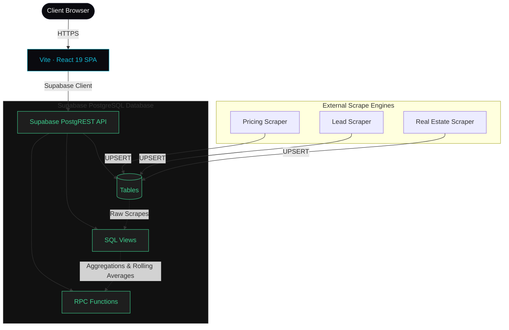

# Joule Dynamics // Enterprise AI Infrastructure


---

## Executive Summary

Joule Dynamics is an enterprise-grade demonstration portfolio built to showcase live, automated data intelligence systems in production. Rather than just listing services, the platform allows clients to interact with live data streams covering e-commerce pricing, B2B lead generation, and real estate rate monitoring. 

The frontend is a highly polished React SPA running on Vite, which consumes data from an external Supabase PostgreSQL backend. Complex data processing, deduplication, and anomaly detection are pushed down to the database layer via PostgreSQL views and RPC functions, allowing the React frontend to remain thin, fast, and purely focused on presentation.

---

## System Architecture

The project operates entirely on a Serverless Frontend + Database-as-a-Backend architecture.


```mermaid
flowchart TD
    A([Client Browser]) -->|HTTPS| B[Vite · React 19 SPA]
    
    B -->|Supabase Client| C[Supabase PostgREST API]
    
    subgraph Supabase [Supabase PostgreSQL Database]
        C --> D[(Tables)]
        C --> E[SQL Views]
        C --> F[RPC Functions]
        
        D -.->|Raw Scrapes| E
        E -.->|Aggregations & Rolling Averages| F
    end
    
    subgraph Scrapers [External Scrape Engines]
        G[Pricing Scraper] -->|UPSERT| D
        H[Lead Scraper] -->|UPSERT| D
        I[Real Estate Scraper] -->|UPSERT| D
    end
    
    style A fill:#0a0a0f,color:#f0f0f0,stroke:#1e2030
    style B fill:#0a0a0f,color:#14b8d4,stroke:#14b8d4
    style C fill:#1e1e1e,color:#3ECF8E,stroke:#3ECF8E
    style D fill:#1e1e1e,color:#3ECF8E,stroke:#3ECF8E
    style E fill:#1e1e1e,color:#3ECF8E,stroke:#3ECF8E
    style F fill:#1e1e1e,color:#3ECF8E,stroke:#3ECF8E
    style Supabase fill:#111,stroke:#333
```

- **Frontend:** React 19, Vite, Tailwind CSS v4, Recharts, Mapbox GL JS, Lucide React.
- **Backend Layer:** Supabase (PostgreSQL). The frontend rarely queries raw tables directly; instead, it subscribes to optimized `v_*` SQL views (e.g., `v_rate_volatility`, `v_price_volatility`).
- **Data Collection:** External cron-based scrapers (Scrapling + proxies) run independently and push directly into Supabase.

---

## Core Live Systems

### 1. Pricing Monitor (`/live-systems#pricing`)
Tracks real-time e-commerce competitor pricing to detect out-of-stock events and stealth markdowns.
- **Data Model:** Tracks SKUs across multiple competitors.
- **View Logic:** `v_category_price_index` rolls up pricing into hourly buckets. `v_price_volatility` tracks individual product availability and recent price drops.
- **Collection Cadence:** Frequent intra-day checks.

### 2. Real Estate Rate Monitor (`/real-estate`)
Live nightly rate intelligence across short-term rental markets (Airbnb/Vrbo).
- **Data Model:** Tracks specific property IDs, their nightly rates, bedrooms, and ratings.
- **View Logic:** `v_rate_volatility` computes a 7-day trailing average benchmark for each property directly in SQL, flagging deviations (surges/drops) >= 25%.
- **Collection Cadence:** 4× daily.
- **Known Limitations:**
  - **Lookahead Window:** Only checks a fixed 2-night window starting on the scrape date. It does not scrape full calendars.
  - **Booking vs Blocked:** Cannot distinguish between a calendar being blocked by the host vs. booked by a guest; both register as "Unavailable".
  - **Market Scope:** Currently restricted to NYC and Miami around the 2026 World Cup Final dates. This is a deliberate configuration choice to showcase volatility, not a technical limitation.

### 3. Lead Generator (`/live-systems#leads`)
Extracts and enriches B2B contacts from difficult-to-scrape directories.
- **Data Model:** Tracks leads by industry, location, and platform source.
- **View Logic:** `v_lead_generation_metrics` calculates enrichment success rates, extraction velocity, and categorizes leads.

### 4. Agentic RAG / Automation Engine
- Background intelligence pipelines for AI-driven workflow reporting.

---

## Setup & Local Deployment

The codebase is currently structured as a pure frontend repository interacting with an external Supabase database.

### Prerequisites
- Node.js >= 20.x
- `.env` configured with Supabase and Mapbox keys.

### Environment Variables
Create a `.env` file at the root:
```env
VITE_SUPABASE_URL=your_supabase_url
VITE_SUPABASE_ANON_KEY=your_supabase_anon_key
VITE_MAPBOX_TOKEN=your_mapbox_token
```

### Run Locally
```bash
# Install dependencies
npm install

# Start Vite dev server
npm run dev

# Production build
npm run build
```

---

## Known Limitations & Contribution Gaps

If you are extending this system, be aware of the following technical gaps:

1. **Hardcoded Configurations:** 
   - Feature flags, navigation links, and service descriptions are hardcoded in `src/data/config.json`. Any structural changes to the "Solutions Showcase" must be made there.
2. **Missing Backend Scraper Code:** 
   - The actual Python/Playwright scraping pipelines are currently maintained in a separate private repository. This repo only contains the frontend and the SQL schema definitions .
3. **Optimistic Supabase Queries:**
   - Some frontend components query Supabase without strict pagination, relying on the database views to limit record counts (e.g., `LIMIT 100` within the view definition). This approach may not scale infinitely if views are modified improperly.
4. **Real Estate Date Boundaries:** 
   - The 2-night check-in window logic requires precise timezone handling. Date boundaries in the SQL views align with `America/New_York` to ensure clean bucket cutoffs. Do not cast timestamps to plain UTC without adjusting for the local market timezone.
